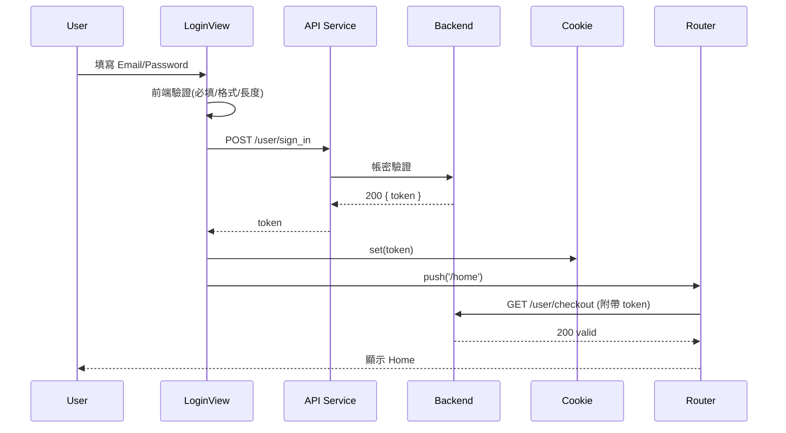
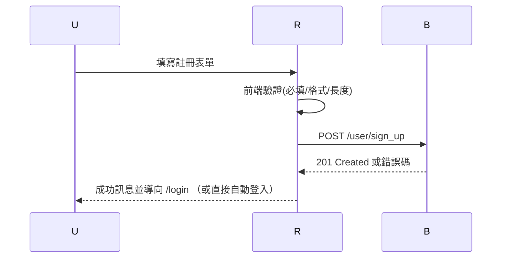
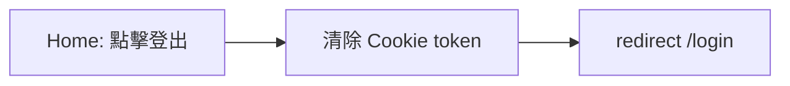
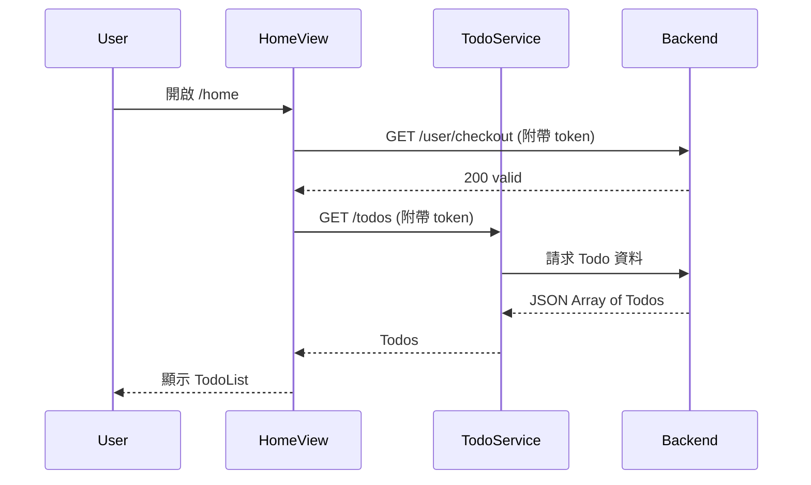
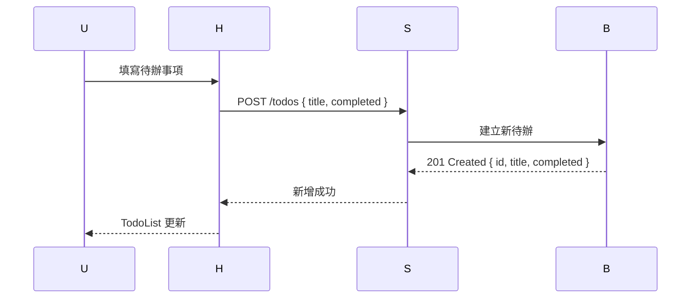
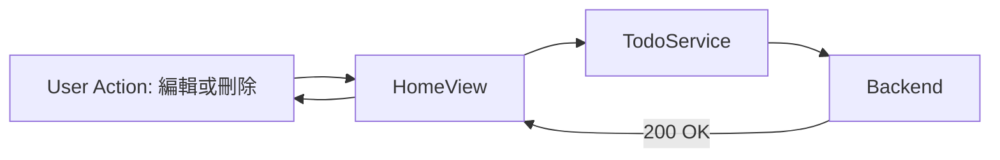

# 1. 需求與目標 (Introduction & Goals)

**商業目標**

- 提供使用者註冊與登入，登入後方可進入首頁（TodoList 應用）。
- 使用者可在首頁新增、查詢、修改、刪除待辦事項 (CRUD)。
- 在首頁可一鍵登出，並保證僅登入狀態下才可操作資料。

**品質目標**

- 安全：以 Token 驗證、最小權限、到期檢查確保未授權使用者無法存取。
- 易用：清楚的錯誤與表單驗證訊息；Todo 操作回饋即時。
- 可維護：前後端職責分離、模組化、清楚的路由與守門邏輯。

**主要利害關係人**

- 使用者：完成註冊/登入/登出流程並管理 TodoList。
- 前端工程師：實作 UI、路由與驗證、與 API 串接。
- 後端工程師：提供身份驗證 API、Token 簽發與驗證、Todo CRUD API。
- 產品/設計：定義畫面流程、表單規則與錯誤訊息。

---

# 2. 限制 (Constraints)

- 僅登入者可訪問首頁（受保護路由）。
- 登入、註冊皆需經由 API 驗證。
- Token 存於 Cookie。
- 表單前端需檢查：必填、密碼長度 ≥ 6、Email 格式。
- 技術棧（建議）：Vue 3 + Vue Router + Axios；可替換等效技術。
- TodoList 資料必須透過 API 取得與修改，不允許未授權存取。

---

# 3. 系統範圍與上下文 (Context & Scope)

**使用者** ↔ **前端 Web 應用** ↔ **認證/使用者 API** + **Todo API**

- 前端：呈現登入/註冊/首頁，負責路由守衛、表單驗證、Token 儲存與攜帶，並操作 TodoList。
- 後端：驗證憑證、簽發 Token、驗證 Token、提供使用者與 Todo 資料端點。

**外部介面**

- Auth API：`POST /user/sign_in`、`POST /user/sign_up`、`GET /user/checkout`、`POST /user/sign_out`
- Todo API：`GET /todos`、`POST /todos`、`PUT /todos/:id`、`DELETE /todos/:id`、`PATCH /todos/{id}/toggle`

---

# 4. 解決策略 (Solution Strategy)

- **授權**：受保護路由（首頁/TodoList）透過路由守衛檢查 Cookie 中的 Token；若無或失效則導回登入頁。
- **狀態**：Token 存於 Cookie；登出時清除 Cookie。
- **表單驗證**：前端同步驗證（必填/長度/格式），再呼叫後端 API 做最終驗證。
- **Todo 資料操作**：所有 CRUD 請求都必須夾帶 Token，由後端驗證授權。
- **錯誤處理**：統一攔截 API 錯誤，顯示友善訊息並視情況導回登入。

---

# 5. 建構構件 (Building Block View)

**前端主要模組**

- `views/LoginView`：登入頁，提供「登入」「註冊帳號」切換/連結。
- `views/RegisterView`：註冊頁，提供「註冊帳號」「登入」切換/連結。
- `views/HomeView`：首頁（受保護），呈現 TodoList 與「登出」功能，進站前驗證 Token。
- `router/index`：定義路由與**全域守衛**（beforeEach）。
- `services/api`：Axios 實例，處理基底 URL、攔截器、攜帶 Token。
- `utils/cookie`：封裝 Cookie 讀寫/刪除。
- `utils/validators`：表單驗證規則。

**（參考）專案結構**

```
src/
  views/
    LoginView.vue
    RegisterView.vue
    HomeView.vue
  components/
    LoadingBox.vue
  router/
    index.js
  services/
    api.js
  utils/
    cookie.js
    validators.js
```

---

# 6. 執行時視圖 (Runtime View)

**6.1 登入流程**



**6.2 註冊流程**



**6.3 登出流程**



**6.4 首頁載入 TodoList**



**6.5 新增 Todo**



**6.6 編輯/刪除 Todo**


